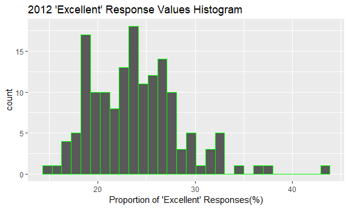
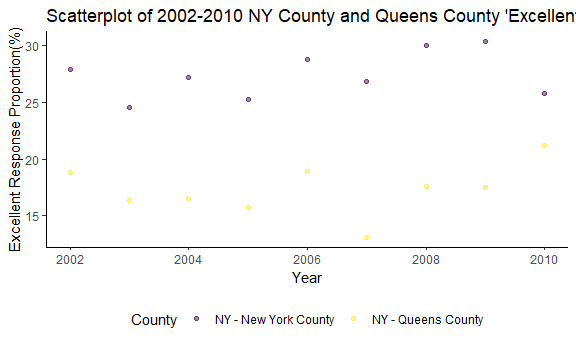

Homework 2
================
Jianyou Liu
September 30, 2018

Problem 1
=========

### The code chunk below imports the NYC Subway Station data

``` r
raw_transit_data = read_csv(file = "./hw2_data/NYC_Transit_Subway_Entrance_And_Exit_Data.csv")
```

    ## Parsed with column specification:
    ## cols(
    ##   .default = col_character(),
    ##   `Station Latitude` = col_double(),
    ##   `Station Longitude` = col_double(),
    ##   Route8 = col_integer(),
    ##   Route9 = col_integer(),
    ##   Route10 = col_integer(),
    ##   Route11 = col_integer(),
    ##   ADA = col_logical(),
    ##   `Free Crossover` = col_logical(),
    ##   `Entrance Latitude` = col_double(),
    ##   `Entrance Longitude` = col_double()
    ## )

    ## See spec(...) for full column specifications.

``` r
raw_transit_data
```

    ## # A tibble: 1,868 x 32
    ##    Division Line  `Station Name` `Station Latitu~ `Station Longit~ Route1
    ##    <chr>    <chr> <chr>                     <dbl>            <dbl> <chr> 
    ##  1 BMT      4 Av~ 25th St                    40.7            -74.0 R     
    ##  2 BMT      4 Av~ 25th St                    40.7            -74.0 R     
    ##  3 BMT      4 Av~ 36th St                    40.7            -74.0 N     
    ##  4 BMT      4 Av~ 36th St                    40.7            -74.0 N     
    ##  5 BMT      4 Av~ 36th St                    40.7            -74.0 N     
    ##  6 BMT      4 Av~ 45th St                    40.6            -74.0 R     
    ##  7 BMT      4 Av~ 45th St                    40.6            -74.0 R     
    ##  8 BMT      4 Av~ 45th St                    40.6            -74.0 R     
    ##  9 BMT      4 Av~ 45th St                    40.6            -74.0 R     
    ## 10 BMT      4 Av~ 53rd St                    40.6            -74.0 R     
    ## # ... with 1,858 more rows, and 26 more variables: Route2 <chr>,
    ## #   Route3 <chr>, Route4 <chr>, Route5 <chr>, Route6 <chr>, Route7 <chr>,
    ## #   Route8 <int>, Route9 <int>, Route10 <int>, Route11 <int>, `Entrance
    ## #   Type` <chr>, Entry <chr>, `Exit Only` <chr>, Vending <chr>,
    ## #   Staffing <chr>, `Staff Hours` <chr>, ADA <lgl>, `ADA Notes` <chr>,
    ## #   `Free Crossover` <lgl>, `North South Street` <chr>, `East West
    ## #   Street` <chr>, Corner <chr>, `Entrance Latitude` <dbl>, `Entrance
    ## #   Longitude` <dbl>, `Station Location` <chr>, `Entrance Location` <chr>

### The code chunk below cleans the NYC Subway Station data

``` r
tidy1_transit_data = 
  janitor::clean_names(raw_transit_data) %>%
  select(line, station_name, station_latitude, station_longitude, route1:route11, entry, vending, entrance_type, ada ) %>% 
  mutate(entry = ifelse(entry == "YES", TRUE, FALSE))

tidy1_transit_data
```

    ## # A tibble: 1,868 x 19
    ##    line  station_name station_latitude station_longitu~ route1 route2
    ##    <chr> <chr>                   <dbl>            <dbl> <chr>  <chr> 
    ##  1 4 Av~ 25th St                  40.7            -74.0 R      <NA>  
    ##  2 4 Av~ 25th St                  40.7            -74.0 R      <NA>  
    ##  3 4 Av~ 36th St                  40.7            -74.0 N      R     
    ##  4 4 Av~ 36th St                  40.7            -74.0 N      R     
    ##  5 4 Av~ 36th St                  40.7            -74.0 N      R     
    ##  6 4 Av~ 45th St                  40.6            -74.0 R      <NA>  
    ##  7 4 Av~ 45th St                  40.6            -74.0 R      <NA>  
    ##  8 4 Av~ 45th St                  40.6            -74.0 R      <NA>  
    ##  9 4 Av~ 45th St                  40.6            -74.0 R      <NA>  
    ## 10 4 Av~ 53rd St                  40.6            -74.0 R      <NA>  
    ## # ... with 1,858 more rows, and 13 more variables: route3 <chr>,
    ## #   route4 <chr>, route5 <chr>, route6 <chr>, route7 <chr>, route8 <int>,
    ## #   route9 <int>, route10 <int>, route11 <int>, entry <lgl>,
    ## #   vending <chr>, entrance_type <chr>, ada <lgl>

The dataset contains **line**, **station names**, **station latitude/longitude**, **routes served**, **whether or not there is an entry**, **whether or not there is a vending machine**, **entrance type**, and **Whether ADA compliant** as its variables.

So far, I cleaned the data by first converting the variables names from uppercase to lowercase. Then, I selected those variables of interest. Finally, I converted the *entry* variable from character to logical. The data is still not tidy right now.

The *dimension* of the resulting data set is 1868, 19

### The code chunk below further cleans the dataset

``` r
tidy2_transit_data = distinct(tidy1_transit_data, line, station_name, .keep_all = TRUE)

ada_data = filter(tidy2_transit_data, ada == TRUE)

proportion_data = filter(tidy2_transit_data, vending == "NO")

tidy2_transit_data
```

    ## # A tibble: 465 x 19
    ##    line  station_name station_latitude station_longitu~ route1 route2
    ##    <chr> <chr>                   <dbl>            <dbl> <chr>  <chr> 
    ##  1 4 Av~ 25th St                  40.7            -74.0 R      <NA>  
    ##  2 4 Av~ 36th St                  40.7            -74.0 N      R     
    ##  3 4 Av~ 45th St                  40.6            -74.0 R      <NA>  
    ##  4 4 Av~ 53rd St                  40.6            -74.0 R      <NA>  
    ##  5 4 Av~ 59th St                  40.6            -74.0 N      R     
    ##  6 4 Av~ 77th St                  40.6            -74.0 R      <NA>  
    ##  7 4 Av~ 86th St                  40.6            -74.0 R      <NA>  
    ##  8 4 Av~ 95th St                  40.6            -74.0 R      <NA>  
    ##  9 4 Av~ 9th St                   40.7            -74.0 F      G     
    ## 10 4 Av~ Atlantic Av~             40.7            -74.0 B      Q     
    ## # ... with 455 more rows, and 13 more variables: route3 <chr>,
    ## #   route4 <chr>, route5 <chr>, route6 <chr>, route7 <chr>, route8 <int>,
    ## #   route9 <int>, route10 <int>, route11 <int>, entry <lgl>,
    ## #   vending <chr>, entrance_type <chr>, ada <lgl>

-   The number of distinct stations is equal to 465.
-   84 stations are ADA compliant.
-   0.5555556 of station entrances/exits without vending allow entrance.(Using the dinstict stations dataset)

### The following code chunk reformats data to allow "route number" and "route name" be distinct variables

``` r
reformat_transit_data = 
  gather(tidy2_transit_data, key = route_number, value = route_name, route1:route11) %>% 
  select(line, station_name, route_number, route_name, everything())

reformat_transit_data
```

    ## # A tibble: 5,115 x 10
    ##    line  station_name route_number route_name station_latitude
    ##    <chr> <chr>        <chr>        <chr>                 <dbl>
    ##  1 4 Av~ 25th St      route1       R                      40.7
    ##  2 4 Av~ 36th St      route1       N                      40.7
    ##  3 4 Av~ 45th St      route1       R                      40.6
    ##  4 4 Av~ 53rd St      route1       R                      40.6
    ##  5 4 Av~ 59th St      route1       N                      40.6
    ##  6 4 Av~ 77th St      route1       R                      40.6
    ##  7 4 Av~ 86th St      route1       R                      40.6
    ##  8 4 Av~ 95th St      route1       R                      40.6
    ##  9 4 Av~ 9th St       route1       F                      40.7
    ## 10 4 Av~ Atlantic Av~ route1       B                      40.7
    ## # ... with 5,105 more rows, and 5 more variables: station_longitude <dbl>,
    ## #   entry <lgl>, vending <chr>, entrance_type <chr>, ada <lgl>

``` r
A_train_data = filter(reformat_transit_data, route_name == "A")
```

The number of distinct stations that serve train A is 60.

Of the stations that serve the A train, 17 are ADA compliant.

Problem 2
=========

### The following code chunk imports Mr.Trash Wheel dataset and cleans the Mr.Trash Wheel sheet

``` r
wheelsheet_data = read_excel("./hw2_data/HealthyHarborWaterWheelTotals2017-9-26.xlsx", sheet = 1, range = "A2:N258") %>% 
  janitor::clean_names() %>% 
  rename(weight = weight_tons, volume = volume_cubic_yards) %>% 
  filter(!is.na(dumpster)) %>% 
  mutate(sports_balls = as.integer(round(sports_balls)))

wheelsheet_data
```

    ## # A tibble: 215 x 14
    ##    dumpster month  year date                weight volume plastic_bottles
    ##       <dbl> <chr> <dbl> <dttm>               <dbl>  <dbl>           <dbl>
    ##  1        1 May    2014 2014-05-16 00:00:00   4.31     18            1450
    ##  2        2 May    2014 2014-05-16 00:00:00   2.74     13            1120
    ##  3        3 May    2014 2014-05-16 00:00:00   3.45     15            2450
    ##  4        4 May    2014 2014-05-17 00:00:00   3.1      15            2380
    ##  5        5 May    2014 2014-05-17 00:00:00   4.06     18             980
    ##  6        6 May    2014 2014-05-20 00:00:00   2.71     13            1430
    ##  7        7 May    2014 2014-05-21 00:00:00   1.91      8             910
    ##  8        8 May    2014 2014-05-28 00:00:00   3.7      16            3580
    ##  9        9 June   2014 2014-06-05 00:00:00   2.52     14            2400
    ## 10       10 June   2014 2014-06-11 00:00:00   3.76     18            1340
    ## # ... with 205 more rows, and 7 more variables: polystyrene <dbl>,
    ## #   cigarette_butts <dbl>, glass_bottles <dbl>, grocery_bags <dbl>,
    ## #   chip_bags <dbl>, sports_balls <int>, homes_powered <dbl>

### The following code chunk reads in and cleans data for 2016&2017 precipitation

``` r
precip_2016_data = read_excel("./hw2_data/HealthyHarborWaterWheelTotals2017-9-26.xlsx", sheet = 4, range = "A2:B14") %>% 
  janitor::clean_names() %>% 
  rename(precip_total = total) %>% 
  mutate(year = 2016) %>% 
  select(month, year, precip_total)

precip_2017_data = read_excel("./hw2_data/HealthyHarborWaterWheelTotals2017-9-26.xlsx", sheet = 3, range = "A2:B10") %>% 
  janitor::clean_names() %>% 
  rename(precip_total = total) %>% 
  mutate(year = 2017) %>% 
  select(month, year, precip_total)

precip_2016_data
```

    ## # A tibble: 12 x 3
    ##    month  year precip_total
    ##    <dbl> <dbl>        <dbl>
    ##  1     1  2016         3.23
    ##  2     2  2016         5.32
    ##  3     3  2016         2.24
    ##  4     4  2016         1.78
    ##  5     5  2016         5.19
    ##  6     6  2016         3.2 
    ##  7     7  2016         6.09
    ##  8     8  2016         3.96
    ##  9     9  2016         4.53
    ## 10    10  2016         0.62
    ## 11    11  2016         1.47
    ## 12    12  2016         2.32

``` r
precip_2017_data
```

    ## # A tibble: 8 x 3
    ##   month  year precip_total
    ##   <dbl> <dbl>        <dbl>
    ## 1     1  2017         2.34
    ## 2     2  2017         1.46
    ## 3     3  2017         3.57
    ## 4     4  2017         3.99
    ## 5     5  2017         5.64
    ## 6     6  2017         1.4 
    ## 7     7  2017         7.09
    ## 8     8  2017         4.44

### The following code chunk combines 2016 and 2017 precipitation into a single dataset and converts *month* to a character variable

``` r
precip_comb_data = 
  bind_rows(precip_2016_data, precip_2017_data) %>% 
  mutate(month = as.character(month))

precip_comb_data
```

    ## # A tibble: 20 x 3
    ##    month  year precip_total
    ##    <chr> <dbl>        <dbl>
    ##  1 1      2016         3.23
    ##  2 2      2016         5.32
    ##  3 3      2016         2.24
    ##  4 4      2016         1.78
    ##  5 5      2016         5.19
    ##  6 6      2016         3.2 
    ##  7 7      2016         6.09
    ##  8 8      2016         3.96
    ##  9 9      2016         4.53
    ## 10 10     2016         0.62
    ## 11 11     2016         1.47
    ## 12 12     2016         2.32
    ## 13 1      2017         2.34
    ## 14 2      2017         1.46
    ## 15 3      2017         3.57
    ## 16 4      2017         3.99
    ## 17 5      2017         5.64
    ## 18 6      2017         1.4 
    ## 19 7      2017         7.09
    ## 20 8      2017         4.44

``` r
wheel_2016_data = filter(wheelsheet_data, year == 2016)
```

-   The number of observations for the resulting Mr. Trash Wheel dataset is 215, and the number of observations for the combined precipitation data of years 2016&2017 is 20.
-   The key variables in the resulting Mr. Trash Wheel dataset are "dumpster number","month","year","date","weight", and "volume". The key variables for the combined precipitation dataset are "month", "year", and "precipitation total".
-   The total precipitation in 2017 is 29.93.
-   The median number of sports balls in a dumpster in 2016 is 26.

Problem 3
=========

### The following code chunk installs and loads the BRFSS data

### The following code chunk cleans and reformats the brfss dataset

``` r
tidy_brfss_data = 
  janitor::clean_names(brfss_smart2010) %>% 
  rename(state = locationabbr, county = locationdesc, resp_id = respid) %>% 
  filter(topic == "Overall Health") %>% 
  select(year:county, response, data_value) %>% 
  spread(response, data_value) %>% 
  janitor::clean_names() %>% 
  select(year, state, county, excellent, very_good, good, fair, poor) %>% 
  arrange(desc(year)) %>% 
  rename(excellent_prop = excellent, very_good_prop = very_good, good_prop = good, fair_prop = fair, poor_prop = poor) %>% 
  mutate(excellent_verygood_prop = excellent_prop + very_good_prop)

tidy_brfss_data
```

    ## # A tibble: 2,125 x 9
    ##     year state county excellent_prop very_good_prop good_prop fair_prop
    ##    <int> <chr> <chr>           <dbl>          <dbl>     <dbl>     <dbl>
    ##  1  2010 AL    AL - ~           18.9           30        33.1      12.5
    ##  2  2010 AL    AL - ~           15.6           31.3      31.2      15.5
    ##  3  2010 AL    AL - ~           20.8           29.5      33.8      11.7
    ##  4  2010 AR    AR - ~           23.1           34.2      35         4.7
    ##  5  2010 AR    AR - ~           29             32        24.1      11.1
    ##  6  2010 AR    AR - ~           24.1           32        31.8       9.7
    ##  7  2010 AZ    AZ - ~           27.3           31.9      27.7       9.6
    ##  8  2010 AZ    AZ - ~           20.5           29        34.8      10  
    ##  9  2010 AZ    AZ - ~           17             38.1      30.4      10.4
    ## 10  2010 CA    CA - ~           24             33.3      28.1      12.3
    ## # ... with 2,115 more rows, and 2 more variables: poor_prop <dbl>,
    ## #   excellent_verygood_prop <dbl>

### The following code manipulates the dataset to answer specific questions

``` r
uniq_loc_data = distinct(tidy_brfss_data, county, .keep_all = TRUE)

uniq_state_data = distinct(tidy_brfss_data, state, .keep_all = TRUE)

Mode = function(x){ 
    if (all(table(x) == max(table(x))))
         mod = NA
    else
         if(is.numeric(x))
    mod = as.numeric(names(table(x))[table(x) == max(table(x))])
    else
         mod = names(table(x))[table(x) == max(table(x))]
    return(mod)
}

excellent_2002_data = filter(tidy_brfss_data, year == 2002)
```

-   The number of unique locations included in the dataset is 404. The answer to whether every state has been represented is TRUE (There are actually 51 states being observed counting DC as one). The state being mostly observed is NJ.
-   The median of the "Excellent" response value in 2002 is 23.6.

### The following code chunk generates plots to visually display the dataset

``` r
hist_2012 = ggplot(excellent_2002_data, aes(x = excellent_prop)) + 
  geom_histogram(color = "green")
hist_2012 + ggtitle("2012 'Excellent' Response Values Histogram") + xlab("Proportion of 'Excellent' Responses(%)")
```

    ## `stat_bin()` using `bins = 30`. Pick better value with `binwidth`.

    ## Warning: Removed 2 rows containing non-finite values (stat_bin).



``` r
ny_county_data = filter(tidy_brfss_data, county == "NY - New York County")
ny_queens_data = filter(tidy_brfss_data, county == "NY - Queens County")

comb_ny_queens_data = inner_join(ny_county_data, ny_queens_data, by = "year")

ggplot(comb_ny_queens_data, aes(x = excellent_prop.x, y = excellent_prop.y)) +
  geom_point(aes(color = year), alpha = .5) +
  labs(
    title = "Scatterplot of 2002-2010 NY County and Queens County 'Excellent' Response Value",
    x = "NY County Excellent Response Proportion(%)",
    y = "Queens County Excellent Response Proportion(%)"
  ) +
  viridis::scale_color_viridis(
  name = "Year"
  ) +
  theme_classic() +
  theme(legend.position = "bottom")
```


